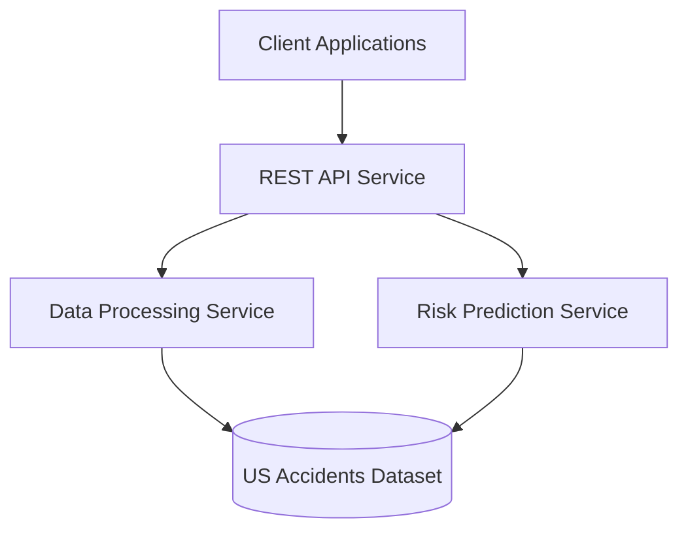

# Functional Requirements and Architecture  
## Rota Maravilhosa – Road Risk Intelligence API

---

# 1. Functional Requirements

The functional requirements describe the system behaviour and define how the platform supports the business capabilities through REST APIs.

---

## FR1 – Accident Statistics by State
**Related Use Case:** UC1 – Retrieve Accident Statistics by State

Retrieve total number of accidents filtered by state and time interval. 

### Functional requirements

- The system shall receive as mandatory input: state, start date, and end date.
- The system shall validate that the dates are valid and that the start date is before the end date.
- The system shall query historical accident records for the specified state and period.
- The system shall calculate the total number of accidents in the period.
- The system shall calculate the average severity of accidents in the period.
- The system shall return the results in a structured format.
- The system shall expose this functionality through a REST endpoint.

### API Endpoint

GET /accidents/statistics/by-state

### Input parameters

- `state` (required)
- `start_date` (required)
- `end_date` (required)

### Output

- `state`
- `totasl_accidents`
- `avg_severity`

---

## FR2 – Accident Analysis by Weather Condition
**Related Use Case:** UC2 – Analyze Accidents by Weather Condition

Analyze relationship between weather conditions and accident severity.

### Functional requirements

- The system shall allow optional filtering by state.
- The system shall group accident records by weather condition.
- The system shall calculate, for each condition: number of accidents and average severity.
- The system shall include only conditions with at least one recorded accident.
- The system shall sort results by accident count (descending).
- The system shall expose this functionality through a REST endpoint.

### API Endpoint

GET /accidents/weather-analysis

### Input parameters

- `state` (optional)

### Output

- `weather_condition`
- `accident_count`
- `avg_severity`

## FR3 – Temporal Risk Analysis
**Related Use Case:** UC3 – Temporal Risk Analysis

The system shall allow users to analyze accident frequency by hour of the day in a specific city.

### Functional requirements

- The system shall receive as mandatory input: city name.
- The system shall allow optional filtering by day of week.
- The system shall query historical records for the specified city.
- The system shall group accidents by hour of the day (0-23).
- The system shall return the accident count for each hour.
- If day of week is provided, the system shall filter only accidents on that day.
- The system shall expose this functionality through a REST endpoint.

### API Endpoint

GET /accidents/temporal-analysis

### Input parameters

- `city ` (required)
- `day_of_week  ` (optional)

### Output

- `hour`
- `accident_count`

# FR4 – Geographical Accident Query  
**Related Use Case:** UC4 – Geographical Bounding Box Query  

The system shall allow users to retrieve traffic accidents that occurred within a defined geographic area using a bounding box.

### Functional Requirements

- The system shall retrieve historical accident records from the dataset.
- The system shall accept geographic coordinates defining a bounding box.
- The system shall filter accident records based on latitude and longitude values.
- The system shall identify accidents that fall within the specified geographic area.
- The system shall return a list of accidents located inside the bounding box.
- The system shall expose this functionality through a REST endpoint.

### API Endpoint

GET /accidents/bounding-box

### Input 

- `min_lat`
- `max_lat`
- `min_lon`
- `max_lon`

### Output

- `latitude`
- `longitude`
- `severity`

---

# FR5 – Accident Severity Prediction  
**Related Use Case:** UC5 – Predict Accident Severity  

The system shall estimate the severity of an accident based on environmental conditions.

### Functional Requirements

- The system shall accept environmental parameters related to weather conditions.
- The system shall process the input parameters using a prediction model.
- The system shall evaluate how environmental factors influence accident severity.
- The system shall generate an estimated accident severity level.
- The system shall return the predicted severity through a REST endpoint.

### API Endpoint
POST /accidents/predict-severity

### Input 

- `visibility`
- `precipitation`
- `weather_condition`

### Output

- `predicted_severity`

---

# FR6 – Risk Score Calculation  
**Related Use Case:** UC6 – Risk Score for Location and Time  

The system shall calculate the accident risk score for a specific geographic location and time.

### Functional Requirements

- The system shall accept geographic coordinates and a timestamp as input.
- The system shall analyze historical accident data around the specified location.
- The system shall evaluate temporal and spatial accident patterns.
- The system shall estimate the probability of an accident occurring.
- The system shall estimate the expected accident severity.
- The system shall return the calculated risk score and severity estimation through a REST endpoint.

**Related API Endpoint:** 
POST /risk/score

### Input 

- `latitude`
- `longitude`
- `timestamp`

### Output

- `accident_probability`
- `predicted_severity`

---

# FR7 – Route Risk Analysis  
**Related Use Case:** UC7 – Route Analysis  

The system shall analyze routes between two locations and recommend a route based on accident risk assessment.

### Functional Requirements

- The system shall accept origin and destination coordinates.
- The system shall evaluate possible routes between the two locations.
- The system shall estimate the accident risk associated with each route.
- The system shall compare routes based on their risk scores.
- The system shall recommend the route with the lowest estimated risk.
- The system shall return the recommended route and associated risk score through a REST endpoint.

**Related API Endpoint:** 
POST /route/analyze

### Input 

- `origin_lat`
- `origin_lon`
- `destination_lat`
- `destination_lon`

### Output

- `recommended_route`
- `risk_score`

## FR8 – Accident Hotspot Detection
**Related Use Case:** UC8 – Verify Accident Hotspots on Map  

The system shall allow users to identify geographic areas with a high concentration of traffic accidents.

### Functional requirements

- The system shall retrieve historical accident records from the dataset.
- The system shall filter accidents by city or state.
- The system shall group accidents by geographic coordinates or zones.
- The system shall calculate the number of accidents per zone.
- The system shall return the top N zones with the highest accident concentration.
- The system shall expose this functionality through a REST endpoint.

### API Endpoint

GET /accidents/hotspots

### Input parameters

- `city` (optional)
- `state` (optional)
- `limit` (optional)

### Output

- `latitude`
- `longitude`
- `accident_count`

---

## FR9 – Accident Occurrence Prediction
**Related Use Case:** UC9 – Predict Accident Occurrence (Time + Weather)

The system shall predict the probability of an accident occurring under specific temporal and environmental conditions.

### Functional requirements

- The system shall accept geographic coordinates.
- The system shall accept hour of the day.
- The system shall accept weather conditions.
- The system shall estimate accident probability using a prediction model.
- The system shall classify the probability into risk levels.

### API Endpoint
POST /accidents/predict-occurrence

### Input

- `latitude`
- `longitude`
- `hour`
- `weather_condition`

### Output

- `accident_probability`
- `risk_level` (Low, Medium, High, Critical)

---

## FR10 – Accident Risk and Severity Simulation
**Related Use Case:** UC10 – Accident Risk and Severity Simulation

The system shall simulate accident risk and estimate expected severity based on environmental and road conditions.

### Functional requirements

- The system shall accept environmental conditions such as weather.
- The system shall accept temporal data (hour).
- The system shall accept road topology sush as roundabouts.
- The system shall calculate a probability score.
- The system shall classify expected accident severity.
- The system shall return the factors contributing to the predicted risk.

### API Endpoint
POST /accidents/simulate-risk

### Input

- `latitude`
- `longitude`
- `hour`
- `weather_condition`
- `road_topology`

### Output

- `probability_score`
- `predicted_severity`
- `explanation`

---

## FR11 – Accident Frequency Comparison Across Counties
**Related Use Case:** UC11 – Accident Frequency Comparison Across County

The system shall compare accident frequency across counties within a state.

### Functional requirements

- The system shall filter accident records by state.
- The system shall group accident records by county.
- The system shall calculate accident counts per county.
- The system shall calculate average severity per county.
- The system shall rank counties based on accident frequency.

### API Endpoint
GET /accidents/county-comparison
### Input

- `state`

### Output

- `county`
- `accident_count`
- `avg_severity`

---

# 2. Application Architecture

The application architecture follows a **service-oriented architecture** where the system exposes data analytics capabilities through a REST API.

The architecture consists of the following components:

### API Service
Responsible for handling HTTP requests and exposing REST endpoints for all business capabilities.

### Data Processing Service
Processes accident data, performs aggregations, and computes statistical metrics.

### Risk Prediction Service
Implements predictive models to estimate accident probability and severity.

### Dataset Storage
Stores accident records from the US Accidents dataset.

### Client Applications

External consumers such as:

- logistics companies
- insurance companies
- municipal governments
- navigation platforms
- individual drivers

---

# 3. Technical Architecture

The technical architecture describes the technologies used and the communication protocols between components.

| Component | Technology |
|---|---|
| API | Python + FastAPI |
| Data Processing | Python + Pandas |
| Prediction Model | Scikit-Learn |
| Dataset Storage | PostGres |
| API Communication | REST (HTTP / JSON) |

Future extensions to include:

- containerization with Docker
- deployment in a cloud infrastructure

---

# 4. Application Architecture Diagram

